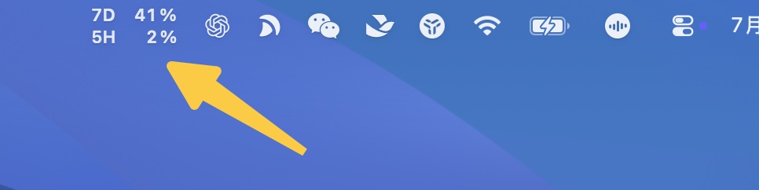
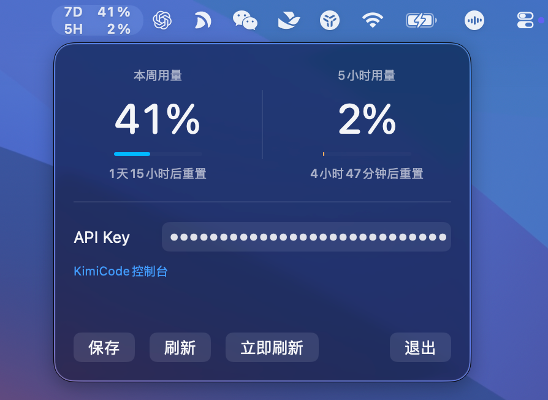

<div align="center">
  
  <h1>KimiCodeBar</h1>
  <p>
    
    <a href="https://www.apple.com/macos"></a>
    <a href="https://github.com/xifandev/KimiCodeBar/releases"></a>
    <a href="https://swift.org"></a>
    <a href="LICENSE"></a>
  </p>
</div>

**KimiCodeBar** 是为 [Kimi Code](https://www.kimi.com/code) 打造的用量实时监控小工具，采用HTTP协议查询，在菜单中极简轻量化运行。


## 运行效果





## 特性

- **用量监控** — 菜单栏直观显示当前用量等信息
- **新版本提醒** — 检测新版本并提示更新
- **极简轻量化** — 采用HTTP协议轮询，无任何运行负载
- **隐私安全** — Key设备本地存储，不上传云端，代码全部开源

## 安装使用

### 直接下载（推荐）

1. 下载 Releases 中的最新版本（暂未发布，可自行编译）
2. 双击 `KimiCodeBar.app` 即可运行

### 自行编译

```bash
git clone https://github.com/xifandev/KimiCodeBar.git
cd KimiCodeBar
open macOS/KimiCodeBar.xcodeproj
```

使用 Xcode 选择你的 Mac，点击 Run 即可。


## 隐私说明

- API Key 保存在本地设备的 `NSUserDefaults`（`~/Library/Preferences/com.kimicodebar.app.plist`）中
- 不上传到任何第三方服务器
- 所有网络请求均直接发往 Kimi 官方 API（`api.kimi.com`）

## 技术栈

- Swift
- SwiftUI
- AppKit（MenuBarExtra）

## 许可证

[MIT](LICENSE)
