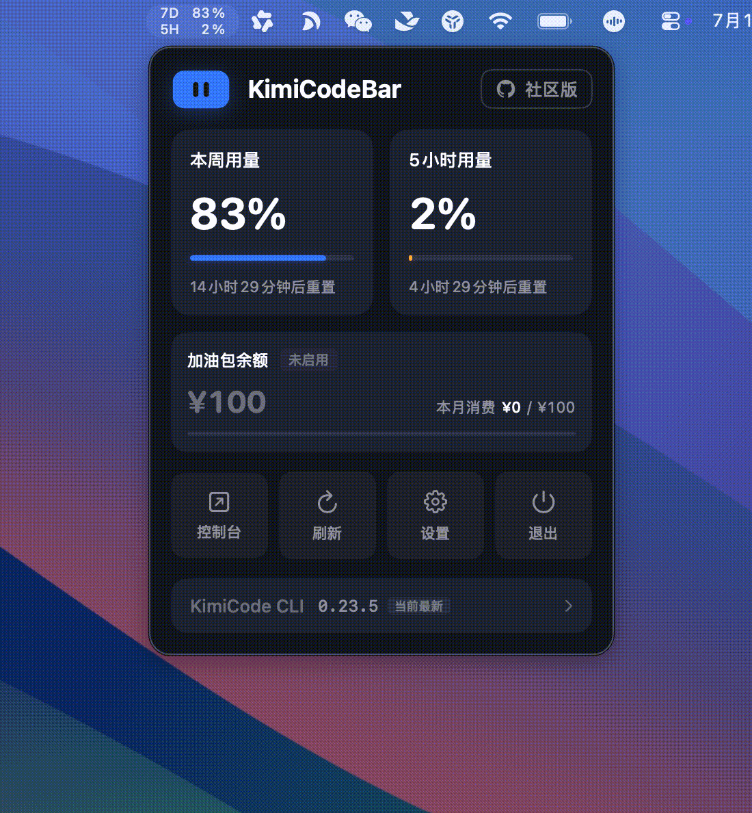

  
  <h1>KimiCodeBar</h1>
  

    
    
    
    
  

**KimiCodeBar** 是为 [Kimi Code](https://www.kimi.com/code) 打造的用量实时监控小工具，采用HTTP协议查询，在菜单中极简轻量化运行。

## 运行展示

  
  

## 功能特性

- **用量监控** — 菜单栏直观显示当前用量等信息
- **新版本提醒** — 检测新版本并提示更新
- **极简轻量化** — 采用HTTP轮询，超级轻量运行
- **隐私安全** — 数据本地存储，代码全部开源

## 安装使用

### GitHub Releases

Download: https://github.com/xifandev/KimiCodeBar/releases

## 支持系统

- MacOS
- Windows（待开发）

## 许可证

[MIT](LICENSE)
